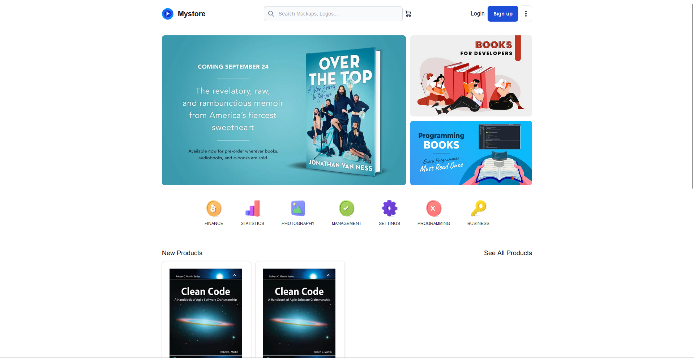
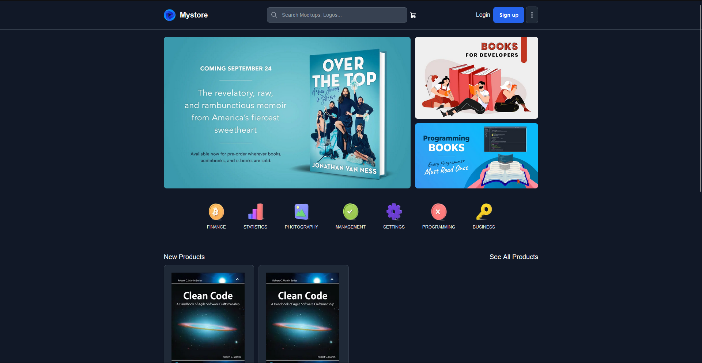

# bookstore-app (not yet finished)

This application is an example of consuming the
[**Monolith Repository Restful API**](https://github.com/hendriam/nodejs-monolith-restful-api). I
built it using NextJS and Tailwind CSS. If you want to run it, you must also run the
[**Monolith Repository Restful API**](https://github.com/hendriam/nodejs-monolith-restful-api).

 
